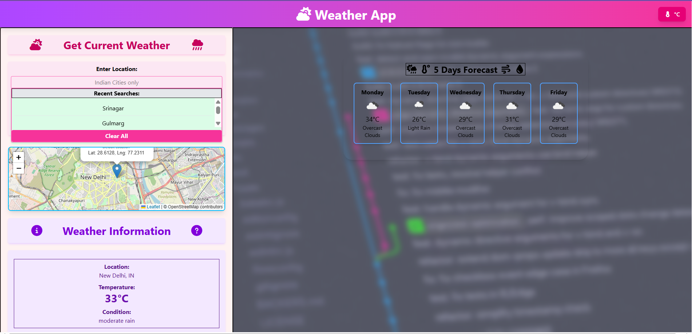
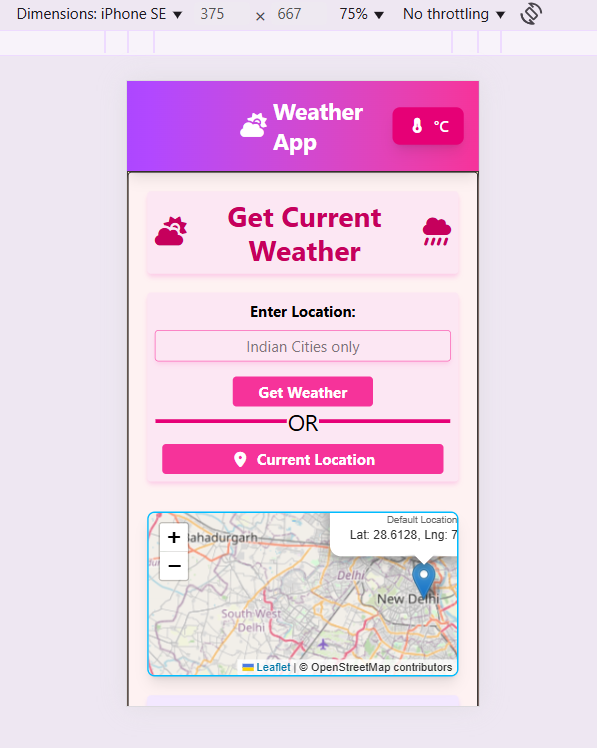
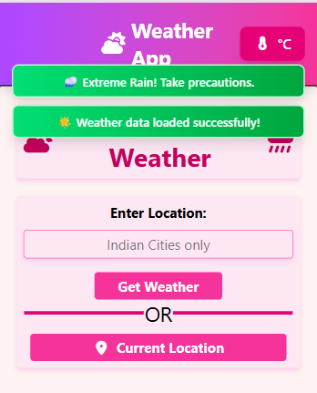
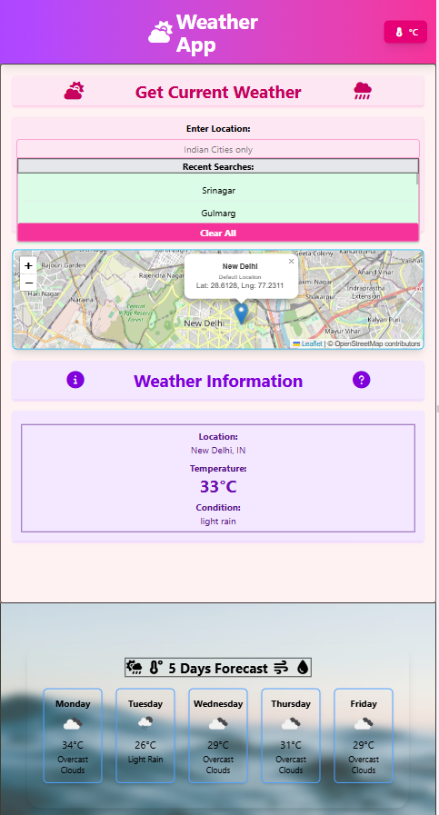
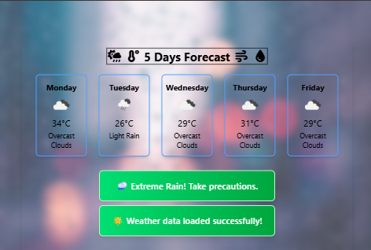
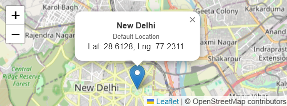
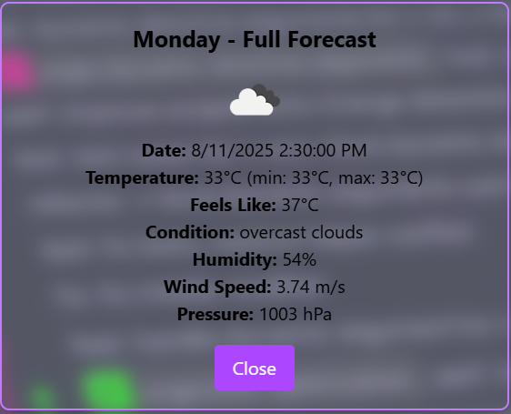

# 🌤️ Weather Forecast Application

Note: create config file as instructed and add your api key in it 


A comprehensive, responsive weather forecast application built with vanilla JavaScript, featuring real-time weather data, interactive maps, and dynamic backgrounds that adapt to weather conditions.

## 📋 Table of Contents

- [✨ Features](#-features)
- [🚀 Live Demo](#-live-demo)
- [📱 Screenshots](#-screenshots)
- [🛠️ Installation](#️-installation)
- [⚙️ Configuration](#️-configuration)
- [🎮 Usage](#-usage)
- [🏗️ Project Structure](#️-project-structure)
- [🌐 API Integration](#-api-integration)
- [📱 Responsive Design](#-responsive-design)
- [🎨 Dynamic Themes](#-dynamic-themes)
- [🔧 Technologies Used](#-technologies-used)
- [🌟 Advanced Features](#-advanced-features)
- [📊 Browser Support](#-browser-support)
- [🤝 Contributing](#-contributing)
- [👤 Author](#-author)
- [🙏 Acknowledgments](#-acknowledgments)

## ✨ Features

### 🔍 **Core Weather Functionality**
- **🌍 City Search**: Search for weather in any Indian city with input validation
- **📍 Current Location**: Automatic weather detection using geolocation API
- **🌡️ Real-time Weather**: Current temperature, humidity, wind speed, and conditions
- **📅 5-Day Forecast**: Extended weather forecast with detailed daily information
- **🌤️ Weather Icons**: Dynamic weather icons from OpenWeatherMap

### 🎛️ **Advanced Controls**
- **🌡️ Global Temperature Toggle**: Single button switches between °C/°F for entire app
- **💾 Recent Searches**: Persistent search history with local storage
- **🗺️ Interactive Maps**: Leaflet.js integration with location markers and popups
- **🚨 Smart Alerts**: Custom weather alerts for extreme conditions (hot, cold, rain, snow)

### 🎨 **Dynamic Visual Experience**
- **🎨 Weather-Based Backgrounds**: Body background changes based on weather conditions
- **🖼️ Dynamic Forecast Images**: High-quality Unsplash images that match weather conditions
- **🌈 Gradient Alerts**: Beautiful gradient alert boxes with weather-specific colors
- **📱 Responsive Design**: Optimized for desktop, tablet, and mobile devices

### 🔧 **Technical Features**
- **⚡ Asynchronous Programming**: Modern async/await for API calls
- **🛡️ Error Handling**: Comprehensive error management and user feedback
- **♿ Accessibility**: Screen reader friendly with proper ARIA labels
- **🔒 Security**: API key management through configuration files

## 🚀 Live Demo

Visit the live application: [Weather App Demo](https://your-weather-app-demo.netlify.app)

## 📱 Screenshots

### 🖥️ Desktop Experience


*Main weather interface showing current weather, 5-day forecast, and interactive map*


*Custom weather alerts with gradient backgrounds for extreme weather conditions*

### 📱 Mobile Experience


*Mobile responsive design with optimized layout for smaller screens*



*Mobile alert positioning at the top of the screen for better visibility*



*5-day forecast cards adapted for mobile viewing with touch-friendly interface*



*Alert display optimization for iPad Mini and tablet devices*

### 🗺️ Interactive Features


*Leaflet.js map with location markers and detailed popups showing coordinates*


*Dropdown showing recent search history with persistent local storage*



*Detailed view of individual forecast day with comprehensive weather information*

## 🛠️ Installation

### Prerequisites
- Modern web browser (Chrome, Firefox, Safari, Edge)
- Text editor or IDE (VS Code recommended)
- Node.js (for Tailwind CSS compilation)

### Quick Start

1. **Clone the repository**
   ```bash
   git clone [https://github.com/yourusername/weather-app.git](https://github.com/steller520/Weather_App.git)
   cd weather-app
   ```

2. **Install dependencies**
   ```bash
   npm install
   ```

3. **Set up API configuration**
   ```bash
   cp src/js/config.example.js src/js/config.js
   ```

4. **Configure your API key**
   Edit `src/js/config.js` and add your OpenWeatherMap API key:
   ```javascript
   const CONFIG = {
       API_KEY: 'your_openweathermap_api_key_here'
   };
   ```

5. **Build Tailwind CSS**
   ```bash
   npm run build-css
   ```

6. **Launch the application**
   ```bash
   npm start
   # or simply open index.html in your browser
   ```

## ⚙️ Configuration

### API Key Setup

1. **Get OpenWeatherMap API Key**
   - Visit [OpenWeatherMap](https://openweathermap.org/api)
   - Sign up for a free account
   - Generate your API key

2. **Configure the application**
   ```javascript
   // src/js/config.js
   const CONFIG = {
       API_KEY: 'your_api_key_here'
   };
   ```

### Tailwind CSS Configuration

The application uses Tailwind CSS with custom configurations:

```javascript
// tailwind.config.js
module.exports = {
  content: ["./src/**/*.{html,js}", "./index.html"],
  theme: {
    extend: {
      // Custom theme extensions
    }
  },
  plugins: []
}
```

### Build Scripts

```json
{
  "scripts": {
    "build-css": "tailwindcss -i ./src/css/input.css -o ./src/css/output.css --watch",
    "start": "live-server ."
  }
}
```

## 🎮 Usage

### Basic Operations

1. **Search for Weather**
   - Type city name in the search box
   - Press Enter or click search button
   - View current weather and 5-day forecast

2. **Use Current Location**
   - Click the "📍 Current Location" button
   - Allow location access when prompted
   - Automatic weather retrieval for your location

3. **Temperature Unit Conversion**
   - Click the thermometer (🌡️) button in the header
   - Instantly converts all temperatures between °C and °F
   - Preference persists across searches

### Advanced Features

4. **Interactive Map**
   - View location marker on the map
   - Click marker for detailed coordinates
   - Map updates automatically with each search

5. **Forecast Details**
   - Hover over forecast cards for quick info
   - Click any forecast card for detailed view
   - Close detailed view to return to forecast

6. **Recent Searches**
   - Click search input to see recent searches
   - Click any recent search to load weather
   - Clear all recent searches with one button

## 🏗️ Project Structure

```
weather-app/
│
├── index.html                 # Main HTML file
├── package.json              # Node.js dependencies
├── tailwind.config.js        # Tailwind CSS configuration
├── .gitignore               # Git ignore rules
├── README.md                # Project documentation
│
├── src/
│   ├── css/
│   │   ├── input.css        # Tailwind CSS source
│   │   └── output.css       # Compiled CSS
│   │
│   ├── js/
│   │   ├── script.js        # Main application logic
│   │   ├── config.js        # API configuration (create from example)
│   │   └── config.example.js # API configuration template
│   │
│   └── assets/
│       ├── favicon/         # Favicon files
│       └── images/          # Application images
│
└── screenshots/             # Application screenshots
    ├── desktop-main.png     # Main desktop interface
    ├── desktop-alerts.png   # Desktop weather alerts
    ├── mobile-portrait.png  # Mobile responsive design
    ├── mobile-alerts.png    # Mobile alert positioning
    ├── mobile-forecast.png  # Mobile forecast view
    ├── alertonmini.png      # iPad Mini alert display
    ├── map-interaction.png  # Interactive map features
    ├── recent-searches.png  # Search history dropdown
    └── forecast-details.png # Detailed forecast view
```

## 🌐 API Integration

### OpenWeatherMap APIs Used

1. **Current Weather API**
   ```javascript
   https://api.openweathermap.org/data/2.5/weather?q=${city},IN&appid=${API_KEY}&units=metric
   ```

2. **5-Day Forecast API**
   ```javascript
   https://api.openweathermap.org/data/2.5/forecast?q=${city},IN&appid=${API_KEY}&units=metric
   ```

3. **Reverse Geocoding API**
   ```javascript
   https://api.openweathermap.org/data/2.5/weather?lat=${lat}&lon=${lon}&appid=${API_KEY}
   ```

### API Features Implemented
- City-based weather search (Indian cities focus)
- Coordinate-based weather fetching
- Weather icons and condition descriptions
- Temperature, humidity, wind, and pressure data
- Error handling for invalid cities or network issues

## 📱 Responsive Design

### Breakpoints
- **Mobile**: ≤ 480px (Fixed alert positioning, compact layout)
- **Tablet**: 481px - 768px (Relative positioning, medium sizing)
- **Desktop**: > 768px (Full layout, all features visible)

### Mobile Optimizations
- Touch-friendly button sizes
- Optimized alert positioning
- Swipe-friendly forecast cards
- Compact information display
- Auto-scroll for better UX

## 🎨 Dynamic Themes

### Background Conditions
- **🔥 Hot Weather** (≥40°C): Orange-red gradient backgrounds
- **❄️ Cold Weather** (≤5°C): Cool blue gradient backgrounds
- **🌧️ Rainy Weather**: Gray-blue stormy backgrounds
- **🌨️ Snowy Weather**: White-gray winter backgrounds
- **☀️ Clear Weather**: Bright sunny backgrounds
- **🌤️ Default**: Pleasant amber-yellow backgrounds

### Forecast Background Images
- High-quality images from Unsplash API
- Weather-condition specific (3 images per condition)
- Smooth transitions between different weather types
- Optimized for performance and visual appeal

## 🔧 Technologies Used

### Frontend
- **HTML5**: Semantic markup and structure
- **CSS3**: Custom styles and animations
- **JavaScript (ES6+)**: Modern JavaScript features
- **Tailwind CSS**: Utility-first CSS framework

### APIs and Libraries
- **OpenWeatherMap API**: Weather data and forecasts
- **Leaflet.js**: Interactive maps and markers
- **Unsplash API**: High-quality background images
- **Geolocation API**: Current location detection

### Tools and Build Process
- **Node.js**: Package management and build tools
- **npm**: Dependency management
- **Tailwind CLI**: CSS compilation
- **Git**: Version control

## 🌟 Advanced Features

### Smart Weather Alerts
```javascript
// Temperature-based alerts
if (temp >= 40) customalert('🔥 Too Hot! Stay hydrated.');
if (temp <= 5) customalert('❄️ Too Cold! Dress warmly.');

// Condition-based alerts
if (condition.includes('rain')) customalert('🌧️ Extreme Rain! Take precautions.');
if (condition.includes('snow')) customalert('🌨️ Snow Alert! Roads may be slippery.');
```

### Global Temperature Conversion
- Converts all temperatures on the page simultaneously
- Supports both Celsius and Fahrenheit
- Maintains preference across different searches
- Updates forecast cards, details, and current weather

### Local Storage Integration
```javascript
// Save and retrieve recent searches
localStorage.setItem("recentSearches", JSON.stringify(searches));
const recentSearches = JSON.parse(localStorage.getItem("recentSearches")) || [];
```

### Interactive Map Features
- Marker popups with coordinates
- Smooth transitions between locations
- Responsive map sizing
- Auto-focus on search results

## 📊 Browser Support

| Browser | Version | Support |
|---------|---------|---------|
| Chrome | 60+ | ✅ Full |
| Firefox | 55+ | ✅ Full |
| Safari | 12+ | ✅ Full |
| Edge | 79+ | ✅ Full |
| Opera | 47+ | ✅ Full |

### Required Features
- ES6+ JavaScript support
- Fetch API
- CSS Grid and Flexbox
- Geolocation API
- Local Storage

## 🤝 Contributing

We welcome contributions to improve the Weather App! Here's how you can help:

### Getting Started
1. Fork the repository
2. Create a feature branch (`git checkout -b feature/amazing-feature`)
3. Commit your changes (`git commit -m 'Add amazing feature'`)
4. Push to the branch (`git push origin feature/amazing-feature`)
5. Open a Pull Request

### Development Guidelines
- Follow existing code style and conventions
- Add comments for complex functionality
- Test on multiple browsers and devices
- Update documentation for new features

### Ideas for Contribution
- Add more weather providers
- Implement weather maps overlay
- Add weather notifications
- Create weather widgets
- Improve accessibility features


```

## 🙏 Acknowledgments

### APIs and Services
- **[OpenWeatherMap](https://openweathermap.org/)** - Weather data and forecasts
- **[Unsplash](https://unsplash.com/)** - High-quality background images
- **[Leaflet](https://leafletjs.com/)** - Interactive maps
- **[OpenStreetMap](https://www.openstreetmap.org/)** - Map tiles and data

### Design and Icons
- **[Tailwind CSS](https://tailwindcss.com/)** - Utility-first CSS framework
- **[Font Awesome](https://fontawesome.com/)** - Icons and symbols
- **[Google Fonts](https://fonts.google.com/)** - Typography

### Development Tools
- **[Visual Studio Code](https://code.visualstudio.com/)** - Code editor
- **[Node.js](https://nodejs.org/)** - JavaScript runtime
- **[Git](https://git-scm.com/)** - Version control

---

## 👤 Author

Made by [steller520](https://github.com/steller520)
---

**Built with ❤️ for weather enthusiasts and developers**

*Happy coding! 🌟*
